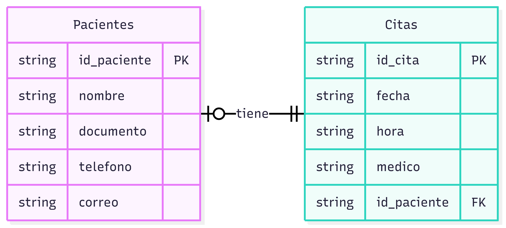
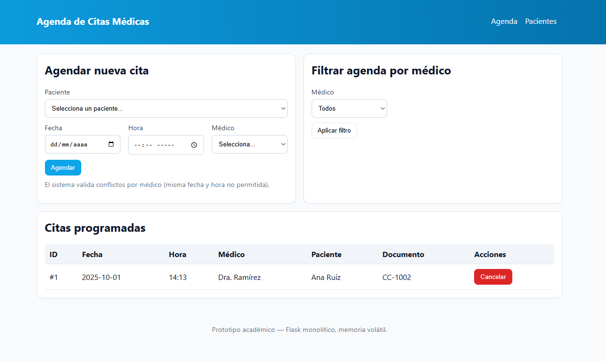
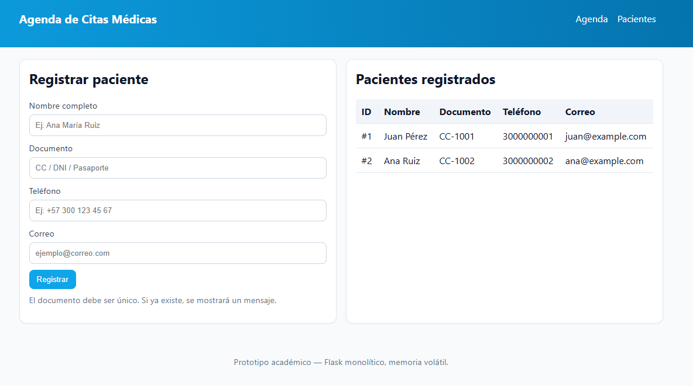

## Tabla de Contenido

- [Sistema de Gestión de Citas Médicas](#sistema-de-gestión-de-citas-médicas)
- [Funcionalidades Clave por Rol](#funcionalidades-clave-por-rol)
  -  [Como Paciente](#como-paciente)
  -  [Como Administrador](#como-administrador)
- [ Criterios de Aceptación](#criterios-de-aceptación)
  -  [Para el Paciente](#para-el-paciente)
  -  [Para el Administrador](#para-el-administrador)
- [ Objetivo General](#objetivo-general)
- [ Definición de Requisitos](#sistema-de-gestión-de-citas-médicas-definición-de-requisitos)
  -  [Requisitos Funcionales (RF)](#requisitos-funcionales-rf)
  -  [Requisitos No Funcionales (RNF)](#requisitos-no-funcionales-rnf)
- [ Diagramas UML](#diagramas-uml-entidades-y-casos-de-uso)
- [ Arquitectura del Proyecto](#arquitectura-del-proyecto)
- [ Instrucciones de Ejecución](#instrucciones-de-ejecución-del-proyecto)
  -  [1. Configuración del Entorno Virtual (Python)](#1-configuración-del-entorno-virtual-python)
  -  [2. Instalación de Dependencias](#2-instalación-de-dependencias)
  -  [3. Ejecución de la Aplicación](#3-ejecución-de-la-aplicación)
  -  [4. Desactivación del Entorno Virtual](#4-desactivación-del-entorno-virtual-)
- [ IDE Utilizado](#requisitos)
- [ Preview de la Aplicación](#preview-de-la-aplicación)


# Sistema de Gestión de Citas Médicas

Este proyecto tiene como objetivo desarrollar un sistema que permita a los **Pacientes** agendar, ver y cancelar sus citas médicas, y a los **Administradores** gestionar y mantener la integridad de la agenda de atención.

---

## Funcionalidades Clave por Rol

Las funcionalidades del sistema están definidas por las siguientes **Historias de Usuario**:

### Como Paciente

| Funcionalidad | Descripción |
| :--- | :--- |
| **Registro y Autenticación** | Registrarme en el sistema con mis datos básicos. |
| **Agendar Cita** | Elegir y reservar una cita médica indicando **fecha, hora** y **médico**. |
| **Consultar Citas** | Ver un listado de mis citas agendadas con sus detalles (**fecha, hora, médico y estado**). |
| **Cancelar Cita** | Cancelar una cita que aún no se ha llevado a cabo. |

### Como Administrador

| Funcionalidad | Descripción |
| :--- | :--- |
| **Gestión de Agenda** | Visualizar la agenda global, viendo las citas de todos los médicos por **fecha y franja horaria**. |
| **Consulta y Filtro** | Ver una lista completa de todas las citas, con la opción de filtrar por médico. |
| **Cancelación de Citas** | Cancelar citas si es necesario por motivos administrativos. |

---

## Criterios de Aceptación

Estos criterios serán usados para validar el correcto funcionamiento de cada rol.

### Para el Paciente

* **[CA-P1]** El paciente puede **registrarse** exitosamente con **nombre, documento, teléfono y correo**.
* **[CA-P2]** El paciente puede ver un **listado de sus citas** que contenga al menos **fecha, hora, médico y estado**.
* **[CA-P3]** El paciente puede **crear una cita** indicando **fecha, hora y médico**.
* **[CA-P4]** El sistema debe **alertar al paciente** si el horario seleccionado ya está ocupado por ese médico.
* **[CA-P5]** El paciente puede **cancelar una cita** siempre y cuando esta no haya ocurrido aún.

### Para el Administrador

* **[CA-A1]** El administrador puede ver una **lista de todas las citas** ordenada por **fecha/hora**, con la opción de **filtrar por médico**.
* **[CA-A2]** El sistema debe **impedir** la creación de **citas conflictivas** (doble reserva para el mismo médico en la misma fecha y hora).
* **[CA-A3]** El administrador puede **cancelar citas** existentes.

---

## Objetivo General

**Garantizar la integridad de la agenda médica** eliminando la posibilidad de citas duplicadas y ofreciendo a los pacientes un medio eficiente para gestionar su atención médica.

# Sistema de Gestión de Citas Médicas: Definición de Requisitos

Este documento detalla los requisitos funcionales y no funcionales que guiarán el desarrollo del sistema de agendamiento de citas médicas.

---

## Requisitos Funcionales (RF)

Definen las acciones que el sistema debe poder realizar para satisfacer las necesidades del usuario.

| ID | Requisito Funcional |
| :--- | :--- |
| **RF-01** | **Registro de Pacientes:** Permitir el registro de nuevos pacientes con los datos: **nombre, documento, teléfono y correo**. |
| **RF-02** | **Listado de Pacientes:** Mostrar una lista de todos los pacientes que han sido registrados en el sistema. |
| **RF-03** | **Agendamiento de Citas:** Crear citas indicando el **paciente, fecha, hora y médico** seleccionado. |
| **RF-04** | **Validación de Agenda:** Implementar una validación que **impida agendar una cita** si el médico ya tiene otra reserva en la **misma fecha y hora**. |
| **RF-05** | **Listado de Citas:** Mostrar listados de citas, tanto la **agenda global** como las **citas específicas por paciente**. |
| **RF-06** | **Cancelación de Citas:** Permitir la cancelación de citas existentes. |
| **RF-07** | **Interfaz Mínima:** Desarrollar una interfaz web básica que soporte las siguientes operaciones: *Registrar pacientes*, *Agendar citas*, y *Listar/Cancelar citas*. |
| **RF-08 (Opcional)** | **Búsqueda/Filtrado:** Agregar una funcionalidad para buscar o **filtrar la vista de agenda por médico**. |

---

## Requisitos No Funcionales (RNF)

Definen los criterios que se utilizarán para juzgar la operación del sistema, más allá de la funcionalidad específica.

| ID | Requisito No Funcional | Descripción |
| :--- | :--- | :--- |
| **RNF-01** | **Usabilidad** | La interfaz debe ser **simple y clara**, con formularios cortos y mensajes de validación básicos para guiar al usuario. |
| **RNF-02** | **Rendimiento** | El sistema debe tener un tiempo de **respuesta percibida menor a 1 segundo** para las operaciones básicas en un entorno local de desarrollo. |
| **RNF-03** | **Mantenibilidad** | El código debe estar **comentado y organizado en un único archivo** (`app.py`) para facilitar la corrección y revisión en un contexto de aula. |
| **RNF-04** | **Portabilidad** | El proyecto debe ser **ejecutable con `python app.py`** después de instalar `flask` (`pip install flask`) en sistemas operativos Windows, Linux y Mac. |
| **RNF-05** | **Confiabilidad (Académico)** | La persistencia de los datos será **en memoria** (los datos se pierden al reiniciar la aplicación), lo cual es suficiente para una demo o prototipo académico. |
| **RNF-06** | **Seguridad (Académico)** | El alcance del prototipo es **demostrativo**, por lo que **no se implementarán autenticación ni roles**. (Nota: En un entorno de producción, estos elementos, junto con la protección CSRF, serían obligatorios). |

## Diagramas UML (entidades y casos de uso)



## Arquitectura del Proyecto  

La organización del proyecto sigue una estructura modular que facilita la escalabilidad y el mantenimiento del código:  

```plaintext
DESIGN/
│── app.py                 # Código principal de la aplicación Flask
│── Procfile               # Configuración para desplegar en Render
│── README.md              # Documentación del proyecto
│── render.yaml            # Config opcional para Render
│── requirements.txt       # Dependencias del proyecto
│── src/                   # Recursos gráficos y diagramas
│   ├── UML.png
│   ├── UML2.png
│   ├── preview.png
│   └── preview2.png
│── .gitignore             # Archivos y carpetas a ignorar en Git

```

# Instrucciones de Ejecución del Proyecto

## Requisitos

-   Python 3.10+
-   pip

> ⚡ **IDE UTILIZADO: Visual Studio Code (VS Code)**


## 1. Configuración del Entorno Virtual (Python)

Es fundamental utilizar un entorno virtual para aislar las dependencias del proyecto y evitar conflictos con otras instalaciones de Python.

1.  Crea y activa un entorno virtual:

    -   Windows (PowerShell):

        ``` powershell
        python -m venv .venv
        .venv\Scripts\Activate.ps1
        ```

    -   Linux / macOS (bash/zsh):

        ``` bash
        python3 -m venv .venv
        source .venv/bin/activate
        ```

## 2. Instalación de Dependencias

Instala las librerías necesarias para el proyecto, listadas en el archivo `requirements.txt`.

1.  **Instalar dependencias:**

    ```bash
    pip install -r requirements.txt
    ```

---

## 3. Ejecución de la Aplicación

Una vez configurado el entorno e instaladas las dependencias, puedes iniciar la aplicación principal.

1.  **Ejecutar el archivo `app.py`:**

    ```bash
    python app.py
    ```

La aplicación **Flask** se iniciará y estará disponible en:
👉 **`http://127.0.0.1:5000`**

*(Para detener el servidor, presiona `CTRL+C` en la terminal).*

---

## 4. Desactivación del Entorno Virtual 🚪

Cuando termines de trabajar en el proyecto, desactiva el entorno virtual:

```bash
deactivate
```

## Preview de la aplicación

